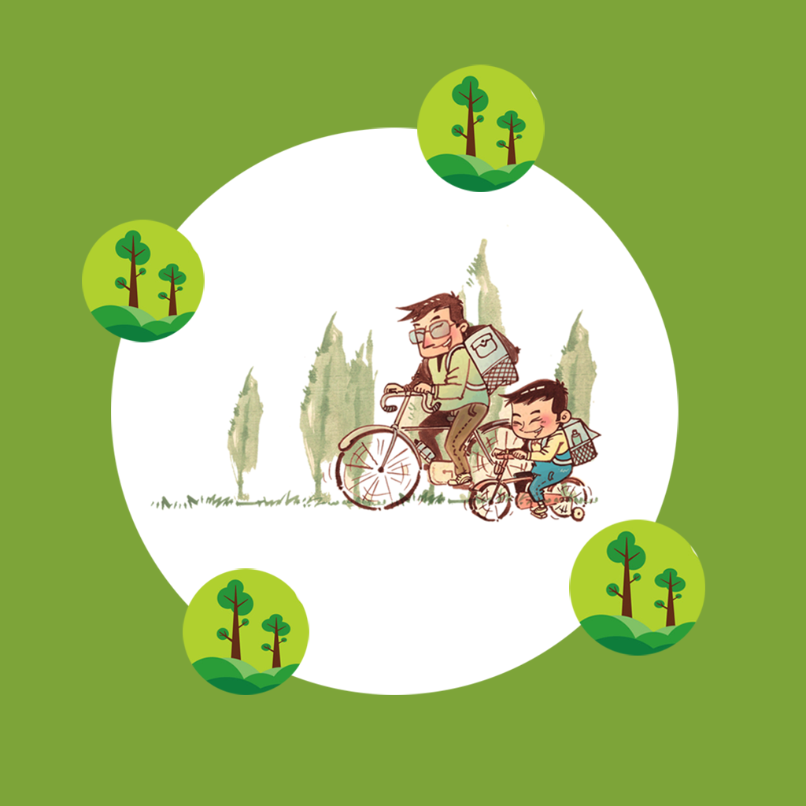

## Welcome to Parent Child Mountain Cycling

Have you ever met a time when you spent less and less time together as your children grew older? Kids love mountain cycling and you often forget to play with them? Resulting in a growing estrangement from the child. If you have this problem, then you can make good use of this app to solve the problem. You can record when and where your child enjoys mountain biking, such as parks, mountain trails, etc. You can also record the distance you and your child worked together to ride, as well as the beautiful scenery and mood you saw along the way. You can record these precious things and share them with your child to promote your relationship and let him grow up healthily.

If you have any questions, you can either leave a message or send the questions to our email address.

We will answer them for you in the first time.

### Address: sun778297ma@163.com

Thank you!
